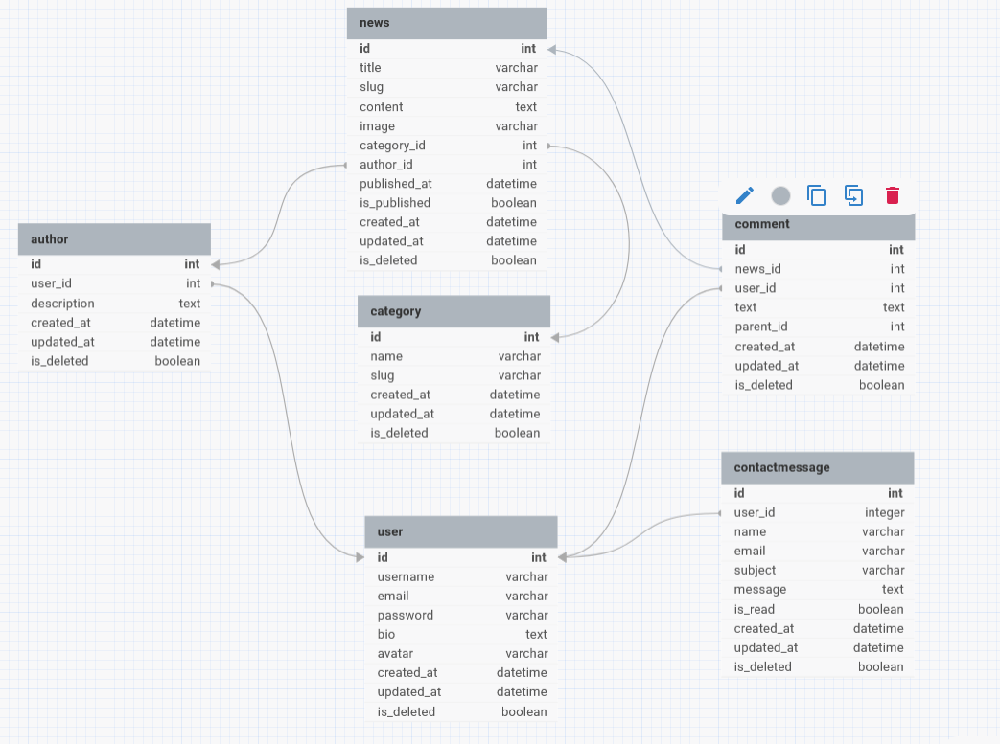

# 📰 Now.kz — News Portal of Kazakhstan

## Project Overview

Now.kz is a news portal built with Django.  
Users can read news articles, leave comments, and authors can publish their own materials.  
The project is based on a modular architecture and uses abstract models for scalability and clean code.


## How to Run the Project

### Requirements

Make sure you have installed:
- Python 3.10 or higher
- pip
- virtualenv (optional but recommended)

### Setup Steps

1. Clone the repository:

    ```
    git clone <repository-url>
    ```

2. Create and activate a virtual environment:

    ```
    python -m venv venv
    source venv/bin/activate      # macOS/Linux  
    venv\Scripts\activate         # Windows
    ```

3. Install dependencies:

    ```
    pip install -r requirements/local.txt
    ```

4. Apply database migrations:

    ```
    python manage.py migrate
    ```

5. Create a superuser

    ```
    python manage.py createsuperuser
    ```

6. Run the development server

    ```
    python manage.py runserver
    ```

7. Follow the link: `http://127.0.0.1:8000/`

## 📦 Apps and Models

### 1. abstracts  
Contains abstract models reused in other applications.  
- AbstractBaseModel — base model with fields created_at, updated_at, and is_deleted.

---

### 2. accounts  
Handles user and author management.  
- User — user model (login, email, bio, avatar).  
- Author — author profile linked to a user (one-to-one relationship).

---

### 3. news  
Stores all data related to news content.  
- Category — news category (e.g., Politics, Sports, Technology).  
- News — news article (title, content, image, category, author, publish date).

---

### 4. comments  
Manages user comments on news articles.  
- Comment — comment made by a user, supports threaded replies.

---

### 5. contacts  
Handles messages sent via the contact form.  
- ContactMessage — message from a user (name, email, subject, message text, read status).

---

## Database Schema

 

## Tests

### 1. accounts  

```
python manage.py seed_users
python manage.py seed_authors
```

---

### 2. news  

```
python manage.py seed_categories
python manage.py seed_news
```

---

### 3. comments  
```
python manage.py seed_comments
```

---

### 4. contacts  

```
python manage.py seed_contacts
```

------------------------------------------------------------------------

# Authentication (JWT)

## POST /api/token/

Obtain access & refresh tokens.

### Request

``` json
{
  "username": "user",
  "password": "secret"
}
```

### Response

``` json
{
  "access": "jwt_access",
  "refresh": "jwt_refresh"
}
```

------------------------------------------------------------------------

## POST /api/token/refresh/

Refresh access token.

------------------------------------------------------------------------

# News API

### GET /news/

HTML --- list of news.

### GET /news/categories/

HTML --- list of categories.

### GET /news/category/{category_id}/

HTML --- news by category.

### GET /news/{news_id}/

HTML --- news details.

------------------------------------------------------------------------

## REST: /api/news/

### GET /api/news/

List all news (JSON).

### GET /api/news/{id}/

Retrieve news.

### POST /api/news/

Create news (auth required).

### PUT /api/news/{id}/

Update news.

### DELETE /api/news/{id}/

Delete news.

------------------------------------------------------------------------

# Categories API

Base: `/api/categories/`

### GET /api/categories/

List categories.

### GET /api/categories/{id}/

Retrieve category.

------------------------------------------------------------------------

# Comments API

HTML Endpoints:

-   GET /comments/news/{news_id}/comments/
-   GET /comments/comments/{comment_id}/
-   GET /comments/my-comments/


------------------------------------------------------------------------

## REST: /api/comments/

### POST /comments/api/comments/{comment_id}/reply/

 Reply to a Comment

Description:
Creates a nested reply to an existing comment.
The reply will automatically inherit:

news — from the parent comment

parent — set to the comment being replied to

user — set to the authenticated user


### GET /api/comments/

List comments.

Query: - news_id\
- parent_only=true

### POST /api/comments/

Create comment.

``` json
{
  "news": 5,
  "text": "Great article!",
  "parent": null
}
```

### PUT /api/comments/{id}/

Update comment (owner only).

### DELETE /api/comments/{id}/

Delete comment.

------------------------------------------------------------------------

# Accounts API

HTML:

-   GET /accounts/authors/
-   GET /accounts/author/{username}/

REST:

## Users

-   GET /api/users/
-   GET /api/users/{id}/
-   POST /api/users/

## Authors

-   GET /api/authors/
-   GET /api/authors/{id}/
-   POST /api/authors/

------------------------------------------------------------------------
